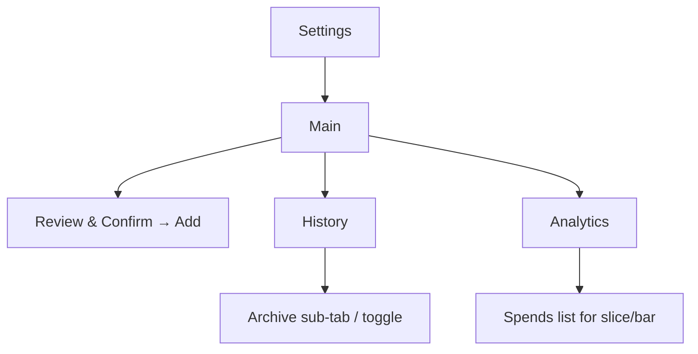

# PRD: spends.ai

- **Vision & Problem Statement**
  A delightful, mobile-first PWA to capture everyday spends via **voice (EN/RU) with live transcript overlay** or **text**; classify amount/merchant/group/tag with a modular AI layer; and visualize trends with smooth, modern UI and playful, 3D-accented aesthetics. The app prioritizes fast capture, minimal friction, and trustworthy analytics with stable, snapshot-per-day FX conversion.

- **Goals & Success Metrics**

* TTFB ≤ 1.0s (P50), ≤ 1.8s (P95) on 4G.
* “Add” flow (stop → parsed → confirm) ≤ 6s (P95) including AI parse.
* Voice start latency ≤ 300ms (P95); UI frame rate 60fps on mid-range iPhone.
* Parse accuracy ≥ 90% on **amount**, ≥ 80% on **merchant guess**, ≥ 80% on **group/tag** (when descriptions exist).
* Crash-free sessions ≥ 99.5%; Add flow success rate ≥ 98%.

- **In Scope / Out of Scope**
  **In:** Voice/text capture, live transcript overlay, Review & Confirm with **Add**, groups (flat), unique tags, archive, History (filters), Analytics (1d/7d/30d/365d), FX (THB↔USD) snapshot per day, main currency total on Main, modular AI via OpenRouter, installable PWA, Google SSO + email/password, React Three Fiber background.
  **Out (v1):** Multi-user sharing, location/receipts, multi-spend input, CSV export, currency switcher in Analytics, delete (Trash), natural-language date parsing.

---

## Personas & Top User Flows

**Personas**

| Persona          | Goals                                     | Pains                                      | Success Criteria                            |
| ---------------- | ----------------------------------------- | ------------------------------------------ | ------------------------------------------- |
| Solo Tracker     | Capture spends instantly; see daily total | Slow apps; forced forms; misclassification | Adds spend in <6s; sees correct total       |
| Power Classifier | Clean data for analytics                  | Inconsistent tags; FX mismatch             | Bulk fixing is rare; analytics feel “right” |
| Visual Analyst   | Quick trends and breakdowns               | Cluttered charts                           | Simple presets; tap → see matching spends   |

**Primary Flows**

- Voice Add: open Main → press mic → speak → live overlay text → press centered mic to stop → auto-parse → Review card → optional edits → **Add**.
- Text Add: type → press arrow → auto-parse → Review → **Add**.
- History: scroll infinite → day dividers → filter (amount range/group/tag/merchant) → edit fields; archived hidden by default.
- Analytics: choose preset → see pie (groups) & bars (daily) → tap slice/bar → list spends; optional “Include archived” (sticky).

---

## Functional Requirements

**MoSCoW Feature Table**

| Feature                                                    | Must/Should/Could | Rationale                 |
| ---------------------------------------------------------- | ----------------- | ------------------------- |
| Voice capture (EN/RU) with live overlay                    | Must              | Frictionless input        |
| Text fallback with classify arrow                          | Must              | Works offline-lite        |
| Review & Confirm with **Add**                              | Must              | Prevent bad saves         |
| AI classification (amount, currency, merchant, group, tag) | Must              | Speed + consistency       |
| Groups (flat) & unique tags                                | Must              | Simple mental model       |
| Archive groups & spends                                    | Must              | Non-destructive lifecycle |
| History infinite list w/ day dividers                      | Must              | Mobile-first UX           |
| Filters (amount range, group, tag, merchant)               | Must              | Find & fix                |
| Analytics (1/7/30/365d)                                    | Must              | Quick insights            |
| Pie by groups; Bar by day; tap → spends                    | Must              | Drill-down clarity        |
| FX daily snapshot (THB/USD)                                | Must              | Stable analytics          |
| Main total converted; rows original                        | Must              | Consistent total          |
| Installable PWA                                            | Should            | iPhone Home Screen        |
| React Three Fiber background                               | Should            | Delightful polish         |
| Google SSO + email/password                                | Should            | Easy sign-in              |
| Model metrics & prompt repo                                | Could             | Future model tuning       |

**Acceptance Criteria (Given/When/Then)**

- **Voice Overlay**
  - Given user presses mic, when recording starts, then display **white, semi-transparent fullscreen overlay** with live transcript (nice legible font) and a **centered mic button** to stop.

- **Stop & Parse**
  - Given user stops, when parse completes, then show Review card with fields: item, amount, currency, merchant (optional), group (optional), tag (0..1), datetime (pre-filled NOW; visible only in History later).

- **Add**
  - Given Review card, when user taps **Add**, then create Spend if **amount** present (merchant optional). If group/tag uncertain, leave blank; user may create new group/tag inline.

- **Auto-guessing**
  - Given ≥70% confidence on item/group/tag, when Review opens, then prefill those; else leave blank. Always prefill amount if confidently parsed.

- **History List**
  - Given a spend whose currency ≠ main currency, when rendering in History, then show **small grey “converted at current rate: \<MAIN_CURR amount>”** under the price; do **not** change stored analytics snapshot.

- **Archive**
  - Given a group archived, when viewing default UI, then hide the group and all its spends from Main/History/Analytics unless **Include archived** is enabled (sticky preference).

- **FX Snapshot**
  - Given first spend of a **local day** (00:00–23:59), when saving, then fetch/store **daily rate** (or use stored/manual override for that date) and snapshot the date on the spend; analytics always use the date’s stored rate.

- **Tap-to-Drill**
  - Given Analytics view, when user taps a pie slice (group) or a bar (day), then show list of matching spends with applied filter chips.

- **Offline-lite**
  - Given network loss, when using text fallback, then allow local queue of one pending spend; sync on reconnect (visible banner).

**Edge Cases & Error States**

- STT unavailable → fallback to text; banner explains.
- Parse fails for amount → highlight amount as required; prevent Add until filled.
- Rate missing for date → fallback strategy: use latest previous stored rate; log warning event.
- Duplicate group/tag name (case-insensitive) → inline error.
- AI timeout (>4s) → show skeleton + retry; user can manually edit fields.

---

## System Architecture (Chosen by LLM)

```mermaid
flowchart TD
  A[PWA Client (React)] -- Auth JWT --> B[Supabase Auth]
  A <--> C[Supabase Postgres (DB)]
  A -- REST/RPC --> D[Supabase Edge Functions]
  D --> C
  D -- OpenRouter API --> E[AI Providers (Classification)]
  D -- FX API (daily) --> F[FX Rates Source]
  G[Scheduled Cron] --> D
  A -- STT(Web Speech) --> A
  A -- STT Fallback --> D:::svc

  classDef svc fill:#eef,stroke:#88f,stroke-width:1px;
```

**Components & Responsibilities**

- **PWA Client**: UI, mic overlay, live transcript (Web Speech API), text fallback, Review & Add, offline queue (1 pending).
- **Supabase Auth**: email+password, Google SSO.
- **Supabase Postgres**: durable storage (spends, groups, tags, fx_rates, settings, model_runs, events).
- **Edge Functions**: `/classify` (parse text → fields), `/fx/snapshot` (ensure rate for date), `/analytics/*` (pre-agg queries), scheduled **cron** to backfill daily FX.
- **AI Providers**: OpenRouter (primary), pluggable interface; prompts stored versioned.
- **FX Source**: free FX API (e.g., exchangerate.host or similar) + manual override.

**Contracts**

- **/classify** (sync): input `{ text, user_id }` → output `{ amount, currency, item?, merchant?, group?, tag?, confidence: {fields...} }` within 4s P95.
- **/fx/snapshot** (sync): input `{ user_id, date }` → ensures `fx_rates` row for `date` exists (honors manual override).
- **Cron** (daily 00:05 local): calls `/fx/snapshot` for last 2 days to guard gaps.

**Data Flow**

1. Add flow triggers `/classify` → client Review → `/fx/snapshot` iff first spend for date → insert `spends`.
2. Analytics use `spends.amount` + `spends.currency` + `spends.fx_rate_date` joined with `fx_rates[date]`.
   **Reliability:** client retries (exponential backoff: 0.5s, 1s, 2s; max 3); idempotency via `x-idempotency-key` header (UUID). Timeouts: client 6s, server 4s.

---

## Data & Domain Model

```mermaid
erDiagram
  USERS ||--o{ SPENDS : "has"
  USERS ||--o{ GROUPS : "owns"
  USERS ||--o{ TAGS : "owns"
  USERS ||--o{ USER_SETTINGS : "has"
  FX_RATES ||--o{ SPENDS : "by fx_rate_date"
  GROUPS ||--o{ SPENDS : "optional"
  TAGS ||--o{ SPENDS : "optional"

  USERS { uuid id PK }
  USER_SETTINGS { uuid user_id FK, text main_currency, bool include_archived_analytics, timestamptz updated_at }

  GROUPS { uuid id PK, uuid user_id FK, text name, text description, bool archived, timestamptz archived_at, timestamptz created_at, timestamptz updated_at, UNIQUE(user_id, lower(name)) }

  TAGS { uuid id PK, uuid user_id FK, text name, text description, timestamptz created_at, timestamptz updated_at, UNIQUE(user_id, lower(name)) }

  FX_RATES { date rate_date PK, numeric usd_per_thb, numeric thb_per_usd, bool manual, timestamptz fetched_at }

  SPENDS { uuid id PK, uuid user_id FK, text item, numeric amount, text currency CHECK IN('THB','USD'),
           text merchant, uuid group_id FK NULL, uuid tag_id FK NULL,
           timestamptz created_at, timestamptz user_local_datetime,
           date fx_rate_date, bool archived, timestamptz archived_at }

  MODEL_RUNS { uuid id PK, uuid user_id FK, text provider, text model, jsonb input, jsonb output, numeric cost, timestamptz created_at }
```

**Schema Notes**

- `user_local_datetime`: captured at client in device timezone; used for day bucketing.
- `fx_rate_date`: local date at save time; joins to `FX_RATES.rate_date`.
- `FX_RATES` stores both directions (redundant for convenience).
- Group/Tag names **unique per user** (case-insensitive); both optional for a spend; **one tag max**.
- Archive realized via flags on **groups** and **spends**.

**Event Models (versioned)**

```json
{
  "v": 1,
  "SpendCreated": {
    "id": "uuid",
    "user_id": "uuid",
    "amount": 120.0,
    "currency": "THB",
    "item": "coffee",
    "merchant": "Starbucks",
    "group_id": null,
    "tag_id": null,
    "user_local_datetime": "2025-08-30T10:12:45+07:00",
    "fx_rate_date": "2025-08-30"
  },
  "GroupArchived": {
    "group_id": "uuid",
    "archived": true,
    "archived_at": "ts"
  },
  "FXRateFetched": {
    "rate_date": "2025-08-30",
    "thb_per_usd": 32.1,
    "source": "api",
    "manual": false
  }
}
```

---

## API Design

**Auth**: Supabase Auth (JWT). Roles: `user`, `service`. Row Level Security: only owner rows visible/writable.

**Endpoints (prefix `/v1`)**

- `POST /classify` → `{ text }` → `{ amount, currency, item?, merchant?, group?, tag?, confidence }`
  Errors: `422 PARSE_FAILED`, `408 TIMEOUT`.
- `POST /fx/snapshot` → `{ date? }` ensures FX row for date; returns `{ rate_date, thb_per_usd, usd_per_thb, manual }`.
- `GET /spends` (filters: `q?`, `amount_min?`, `amount_max?`, `group_id?`, `tag_id?`, `merchant?`, `archived?`, `cursor?`)
  → `{ items:[...], next_cursor? }` newest-first.
- `POST /spends` (Idempotent) → create spend.
  Request headers: `x-idempotency-key`.
- `PATCH /spends/:id` → editable fields: `item, amount, merchant, group_id, tag_id, user_local_datetime, archived`. **Currency not editable.**
- `GET /analytics/summary` (`range=preset`, `include_archived=false`) → `{ total_by_day[], total_by_group[] }` using snapshot rates.
- `GET /groups` / `POST /groups` / `PATCH /groups/:id` (archive/unarchive, rename).
- `GET /tags` / `POST /tags` / `PATCH /tags/:id` (rename).
- `GET /settings` / `PATCH /settings` (main_currency, include_archived_analytics).

**Pagination**: cursor-based (opaque).
**Idempotency**: POSTs require client UUID key; server stores last 24h keys.
**Rate Limits**: 60 req/min per user (burst 30).
**Audit**: server logs into `MODEL_RUNS` and `events` table.

---

## Client UX

**Screens & States**



- **Main**:
  - **React Three Fiber** subtle 3D background (low CPU shader, paused when hidden).
  - Big mic CTA; on record: **white semi-transparent overlay** with live transcript, **centered mic to stop**.
  - Text field with arrow to classify.
  - Bottom: “Today’s spends” (auto-collapse if >5).
  - **Total** in main currency (snapshot per spend); rows show original currency.

- **Review & Confirm**:
  - Fields shown with parsed values; inline create group/tag; primary button **Add**.

- **History**:
  - Infinite scroll; day dividers; filters (amount range, group, tag, merchant).
  - If currency ≠ main: show **small grey converted @ current rate** under price.
  - Archive access via sub-tab/toggle; archived hidden by default.

- **Analytics**:
  - Presets: 1d / 7d / 30d / last 365d; device timezone boundaries.
  - Pie (groups), Bar (daily totals). Tap → spend list.
  - Checkbox **Include archived spends** (persist in `USER_SETTINGS`).

- **Accessibility**: WCAG AA; focus states; 44px touch targets; reduced motion setting disables heavy animations.

---

## Non-Functional Requirements

- **Performance**:
  - P50/P95: Home render ≤ 800/1500ms; Add flow ≤ 6s P95 including model call.
  - Bundle: initial JS ≤ 180KB gzip P95; lazy-load charts/3D.

- **Scalability**:
  - Target 10k MAU; 200 RPS burst on Edge; DB < 5GB.

- **Reliability**:
  - SLO API 99.5%; graceful degradation: disable AI parse on failure, require manual fields.

- **Security & Privacy**:
  - TLS 1.2+; at rest: Postgres + managed disk encryption.
  - Secrets in server env (Edge functions/Vercel).
  - PII minimal (email); no receipts/images v1.
  - GDPR readiness (export/delete data endpoints v1.1).

- **Compliance**: n/a payments; follow GDPR principles.

- **Observability**:
  - Logs: server function logs; structured JSON.
  - Metrics: `/classify` latency/success; FX fetch success; Add flow conversion.
  - Traces (optional): OpenTelemetry via middleware.

- **Cost Guardrails**:
  - OpenRouter calls capped 1 per Add (retries max 1).
  - Monthly budget env var; circuit-break to manual-only mode when exceeded.

---

## Stack & Infrastructure (Selected by LLM)

- **Frontend**: React 18 + Vite + React Router; **styled-components** for CSS (no Tailwind); **Framer Motion** for animations; **React Three Fiber + drei** for 3D; **Recharts** for charts; **Zustand** for local state; **Workbox** for PWA caching.
- **STT**: Web Speech API (EN/RU) on client; **fallback** server `/stt` using Whisper-small via Edge function if browser unsupported (progressive enhancement).
- **Backend**: **Supabase** (Postgres + Auth + Edge Functions + RLS).
- **AI Classification**: Edge Function calling **OpenRouter** (model e.g., `openrouter/fast-mix`), with provider abstraction (`Provider=OpenRouter|…`) and versioned prompts in DB.
- **FX**: Edge Function hitting a free FX API (e.g., exchangerate.host); daily cron via Supabase Scheduled Functions; manual override UI in Settings.
- **Hosting**: Vercel (frontend); Supabase (DB/Auth/Functions).
- **IaC**: Supabase migrations (SQL), seed scripts.
- **CI/CD**: GitHub Actions → typecheck/lint/test → deploy preview → prod.

**Rationale**: Minimal ops, generous free tiers, built-in auth & DB, strong developer velocity; client-side polish stack supports the desired animations and 3D.

---

## Configuration & Environments

- **Feature Flags**: `stt_fallback`, `ai_parse_enabled`, `fx_auto_fetch`, `r3f_bg_enabled`.
- **Config Sources**: `.env` for secrets; `USER_SETTINGS` for per-user prefs (main currency, includeArchivedAnalytics).
- **Secrets**: OpenRouter key, FX API key in server only.
- **Migrations & Seeding**: SQL migrations per release; seed: sample groups/tags.
- **Backward Compatibility**: API additive changes only; DB migrations with `NOT VALID` constraints then validate.

---

## Error Handling & Resilience

- **Taxonomy**: `VALIDATION_ERROR`, `AUTH_REQUIRED`, `PARSE_FAILED`, `FX_MISSING`, `RATE_LIMITED`, `DEPENDENCY_TIMEOUT`.
- **Policies**: Retries (client 0.5/1/2s; server no retry for POST except idempotent) ; circuit breaker for AI provider; DLQ-like table `failed_jobs` for FX fetches.

---

## Testing & Release

- **Tests**:
  - Unit: parsing adapters, reducers, currency math.
  - Integration: `/classify`, `/fx/snapshot`, RLS policies.
  - E2E (Playwright): Voice flow (mock STT), Text flow, History filters, Analytics drilldown.
  - Contract tests: JSON shapes for endpoints; idempotency.
  - Performance: Lighthouse CI budget gates.

- **Coverage Targets**: 80% lines, 90% critical paths (Add, Analytics).

- **Branching**: trunk-based with PR checks; semantic versioning.

- **Deploy**: blue/green via Vercel previews; rollback via previous deployment.

---

## Risks & Mitigations

| Risk                           | Impact            | Mitigation                                                                                  |
| ------------------------------ | ----------------- | ------------------------------------------------------------------------------------------- |
| Browser STT inconsistency (RU) | Voice UX degraded | Progressive enhancement; server Whisper fallback                                            |
| FX API outages                 | Analytics skew    | Daily cron + on-demand fetch; manual override                                               |
| Model misclassification        | User frustration  | Confidence gating; inline edits; descriptions improve priors; provider swap via abstraction |
| Cost spikes (AI)               | Budget overrun    | Rate-limit, monthly cap, circuit break to manual                                            |
| 3D background perf             | Battery drain     | Reduce motion mode; throttle/stop when tab hidden                                           |

---

## Milestones & Delivery Plan

**Phase 0: Foundations (1–2 wks)**

- Supabase project, schema & RLS; Edge Functions scaffold; Auth (email/password + Google).
- Frontend shell, routing, PWA baseline.

**Phase 1: Capture (2 wks)**

- Mic overlay (EN/RU) + text fallback; Review & **Add**; `/classify` integration; groups/tags CRUD.

**Phase 2: History & Archive (1–1.5 wks)**

- Infinite scroll, day dividers, filters; archive model & UI; History converted-at-current-rate subtitle.

**Phase 3: Analytics (1–1.5 wks)**

- FX daily snapshot pipeline; presets; pie & bar; drill-down; sticky “Include archived”.

**Phase 4: Polish & 3D (1 wk)**

- React Three Fiber background; animations; A11y; offline-lite queue; perf budgets.

**Definition of Ready**: user stories w/ AC, designs, API shapes, migration plan.
**Definition of Done**: tests pass, budgets met, docs updated, migration applied, analytics dashboards green.

---

## Assumptions & Open Questions

- **Assumptions**:
  - Device timezone trusted for day boundaries.
  - Only THB and USD v1.
  - Single tag per spend.
  - Currency not editable post-save.

- **Open Questions**:
  - STT fallback quota/cost limits acceptable?
  - Preferred initial AI model on OpenRouter (speed vs cost)?
  - Exact fonts/brand palette (will choose defaults if unspecified).
